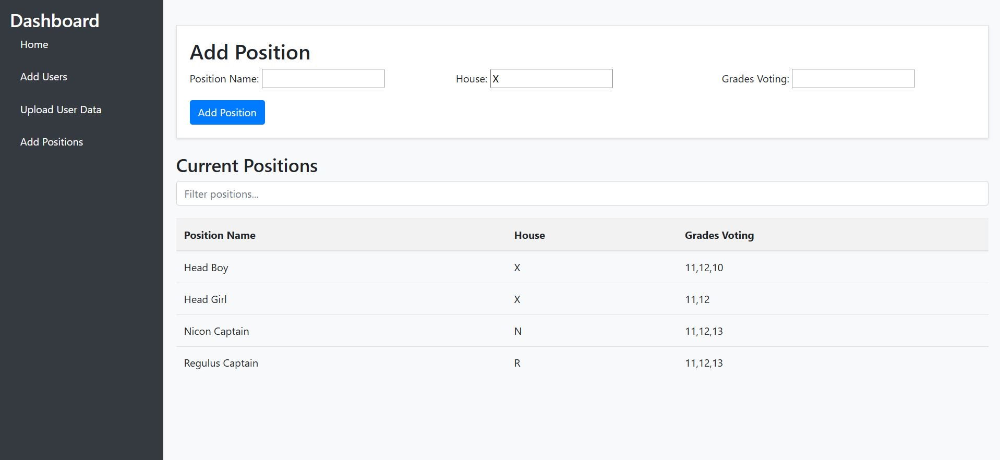

# Student Council Election Voting System

## Description

The Student Council Election Voting System is a web-based application designed to streamline and manage student council elections in educational institutions. Developed using the Django framework, this system provides a secure, transparent, and user-friendly platform for students, administrators, and candidates to participate in the democratic process. It eliminates the inefficiencies of traditional paper-based voting while ensuring the integrity and accuracy of election results.

## Features

* **User Authentication:** Secure login system for students to access the voting platform.
* **Role-Based Access:** Different levels of access for students (by grade) and administrators.
* **Candidate Management:** Functionality for administrators to add, edit, and manage candidates.
* **Real-time Updates:** Dynamic updates using JavaScript, such as live vote counts (where applicable) and notifications.
* **Secure Voting:** Measures to prevent unauthorized access, multiple voting, and tampering.
* **Automated Vote Counting:** Efficient and accurate counting of votes.
* **Results Display:** Clear and immediate display of election results.
* **Audit Trail:** Detailed logging of system activities for transparency and accountability.
* **Reporting:** Generation of election reports and analytics.
* **CSV User Import:** Utility to import user data from CSV files for efficient setup.

## Screenshots

* **Login Page**

    

* **Main Voting Page**

    

* **Results Page**

    

* **Add Position**

  

* **Add Candidate**

  

* **Add Single User**

  

* **Add Multiple Users**

  

## Installation Instructions

1.  **Prerequisites:**
    * Python 3.x
    * pip (Python package installer)

2.  **Clone the repository:**

    ```bash
    git clone <repository_url>
    cd <repository_name>
    ```

3.  **Create a virtual environment (recommended):**

    ```bash
    python3 -m venv venv
    source venv/bin/activate  # On Linux/macOS
    venv\Scripts\activate  # On Windows
    ```

4.  **Install dependencies:**

    ```bash
    pip install -r requirements.txt
    ```

5.  **Set up the database:**

    ```bash
    python manage.py migrate
    ```

6.  **Create a superuser (for admin access):**

    ```bash
    python manage.py createsuperuser
    ```

7.  **Run the development server:**

    ```bash
    python manage.py runserver
    ```

8.  **Access the application in your browser:**
    * `http://127.0.0.1:8000/`

## Usage Examples

1.  **Student Voting:**
    * Students navigate to the login page and enter their credentials.
    * They are presented with the available positions and candidates.
    * Students select their choice and confirm their vote.
2.  **Administrator Actions:**
    * Administrators log in to the admin dashboard.
    * They can manage candidates, start/end elections, and view results.
3.  **CSV User Import:**
    * Prepare a CSV file with user data (username, grade, etc.).
    * Run the `bulk_add_users` function (see `views.py` and `models.py` in the report).
    * This will create user accounts in the system.

    ```python
    # Example usage (in a Django management command or script)
    from yourapp.views import bulk_add_users  # Replace 'yourapp'
    bulk_add_users('/path/to/your/users.csv')
    ```

## Contribution Guidelines

1.  **Fork the repository.**
2.  **Create a new branch for your feature or bug fix.**
3.  **Make your changes and commit them with clear, descriptive messages.**
4.  **Test your changes thoroughly.**
5.  **Submit a pull request to the `main` branch.**

Please ensure your code adheres to the project's coding style and includes appropriate documentation and tests.

## License

This project is licensed under the **MIT License**.

MIT License

Copyright (c) 2024 Anish Balabattuni, Akshay Nagaraj

Permission is hereby granted, free of charge, to any person obtaining a copy
of this software and associated documentation files (the "Software"), to deal
in the Software without restriction, including without limitation the rights
to use, copy, modify, merge, publish, distribute, sublicense, and/or sell
copies of the Software, and to permit persons to whom the Software is
furnished to do so, subject to the following conditions:

The above copyright notice and this permission notice shall be included in all
copies or substantial portions of the Software.

THE SOFTWARE IS PROVIDED "AS IS", WITHOUT WARRANTY OF ANY KIND, EXPRESS OR
IMPLIED, INCLUDING BUT NOT LIMITED TO THE WARRANTIES OF MERCHANTABILITY,
FITNESS FOR A PARTICULAR PURPOSE AND NONINFRINGEMENT. IN NO EVENT SHALL THE
AUTHORS OR COPYRIGHT HOLDERS BE LIABLE FOR ANY CLAIM, DAMAGES OR OTHER
LIABILITY, WHETHER IN AN ACTION OF CONTRACT, TORT OR OTHERWISE, ARISING FROM,
OUT OF OR IN CONNECTION WITH THE SOFTWARE OR THE USE OR OTHER DEALINGS IN THE
SOFTWARE. 

## Contact

* Anish Balabattuni
* Akshay Nagaraj

---

